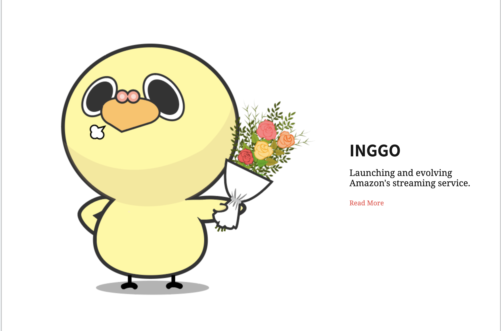

# Profile

**박성근 /Park Seong Keun / 朴晟謹**

산업경영공학을 전공중인 평범한 대학생입니다.

- 대한민국 서울특별시 마포구 서교동 거주
- 군필 (대한민국 공군 2015.06.21 ~ 2017.06.21)
- Phone : +82 10-4783-2037
- Email : ssxkeun@gmail.com
- GitHub : github.com/parkseongkeun

# 학력 / Education
_______________________________________________
## 상명대학교
- 대한민국 서울특별시 종로구 소재
- 산업경영공학전공
- 학적 변동 이력
  - 2013.02 ~ 2014.12.27 / 경영학과 재학
  - 2015.03. ~ / 산업경영공학과 전과
  - 2015.06. ~ 2017. 06 / 군복무 

## 경성고등학교
- 대한민국 서울특별시 마포구 연남동 소재
- 2009.03 ~ 2012.02 / 졸업

# 보유 기술 / Skills
_______________________________________________
이름 | 하 | 중하 | 중 | 중상 | 상
--- | --- | --- | --- | --- | ---
Sketchapp ||O| | | |
Photoshop |O| | | | |
illustrator |O| | | | |

# 프로젝트 / Projects
_______________________________________________
## 강아지 운동 IOT 앱
- 개인 프로젝트 / 2019.04.03 ~ 2019.04.25
- 

## 메가박스
- 팀 프로젝트 / 2019.03.04 ~ 2019.04.03
- 

## 사랑먹고 잉꼬
- 팀 프로젝트 / 2019.04.23 ~ 2017.11.24
- 

- 

# 수상 경력 / Awards
_______________________________________________
## [SK 브로드밴드](http://www.newstomato.com/ReadNews.aspx?no=390075)
- 

## 국방부주관 국가안보경연대회 
-  3위

## 
- 
- 

# 어학점수 / Awards
_______________________________________________
## TOEIC
-

## OPIC
-

## IBT TOEFL
-

# 자격증  
_______________________________________________
## 사무자동화 산업기사
- 사무자동화 산업기사 자격증(2017.02)

## 한국사
- 한국사 검증능력시험 1급(2016.09)

## MOS Master
- MOS Word, MOS Powerpoint, MOS Excel(2016.02)

##